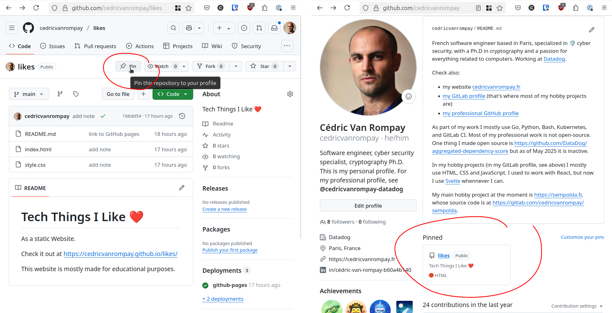

# Compte GitHub et Portfolio

Cédric Van Rompay\
Juin 2025

---

# Pourquoi avoir un compte GitHub

 

Pour les autres :
* informer
* inspirer

Pour soi :
* expérimenter
* pratiquer

---

# Informer les autres

---

# Inspirer

* des projets
* les meilleurs projets en avant
* diversité
* impact

_(j'appelle « projet » ce que GitHub appelle « repository »)_

---

# Expérimenter & pratiquer

* une idée → un projet
* une techno cool → un projet
* une liste → un projet

créer plein de projets, c'est :

* zéro coût
* de la visibilité
* du fun

On apprend:
* à créer un projet
* à passer de la théorie à la pratique
* à travailler en public

---

# Attention !

 

Quand on travaille en public (site perso, projets GitHub publics):

* ne pas mettre de données sous copyright / droits d'auteurs
* ne pas mettre de mots de passe    
* faire attention à ses données personelles
* faire **très** attention aux données personelles des autres !

---

# Des Liens

Beaucoup de liens !

* de LinkedIn à GitHub
* de GitHub à LinkedIn
* de vos comptes à votre site perso
* de votre site perso à vos comptes

---

# Est-ce que ça marche?

Personellement, oui

---

# Est-ce que ça marche?

Personellement, oui

---

# Faire son "README" sur GitHub

* fait par GitHub pour se présenter
* à l'origine, "README" = point d'entrée de la documentation
* créer un projet dont le nom est votre pseudo GitHub
* créer un fichier `README.md` dedans
* écrire du texte au format Markdown

Documentation :
* https://docs.github.com/fr/account-and-profile/setting-up-and-managing-your-github-profile/customizing-your-profile/managing-your-profile-readme#adding-a-profile-readme
* https://docs.github.com/fr/get-started/writing-on-github/getting-started-with-writing-and-formatting-on-github/basic-writing-and-formatting-syntax

---

# Démo

 

https://github.com/new

https://github.com/cedricvanrompay/cedricvanrompay

---

# Site perso facile: « pages GitHub »

 

Votre premier « vrai projet »

Documentation: https://pages.github.com/

* créez un projet dont le nom est `<votre pseudo GitHub>.github.io`
* écrivez du HTML, CSS et JavaScript dedans
* allez dans les réglages de votre projet, activez les « pages GitHub »

Plus tard vous pourrez aussi faire générer le site web par un framework : https://jekyllrb.com/, https://gohugo.io/, https://docusaurus.io/, https://vitepress.dev/, https://nextjs.org/, https://svelte.dev/ ...

---

# Démo

 

* https://github.com/cedricvanrompay/cedricvanrompay.github.io (archivé)
* exemple avec des pages GitHub pour un **projet** :
    * https://github.com/cedricvanrompay/likes
    * https://github.com/cedricvanrompay/likes/settings/pages

---

# Mettre des projets en avant

 

La plupart des gens ne vont pas passer beaucoup de temps sur votre profil.

Assurez-vous qu'ils voient ce qu'il y a de plus important à voir.

Pas besoin de cacher vos mini-projets ou ceux à l'abandon, mais il ne faut pas que ce soit ça qui ressorte.

---

# Épingler un projet sur GitHub

En anglais : _« pin a repository »_

---

# Faites vos expériences autre part que sur vos projets phares

 

* projets phares : besoin de valeur sûre
* autre projets : besoin de liberté et de ne pas se prendre la tête

---

# Idées de projets en vrac

* journal de dévelopement
* liste d'articles que vous lisez, de vidéos que vous regardez sur la tech, etc...
* générateur de site statique, de présentations...
* des thèmes pour tout plein de framework (et des galeries de thèmes)
* un site web généré automatiquement qui retrace votre activité sur GitHub
* des idées de design de portfolios qui exposent .. des idées de design de portfolio

---
layout: center
---

# Merci :-)

 

Retrouvez ces slides sur ... ce repository GitHub !

https://github.com/cedricvanrompay/slides-guide-profil-github